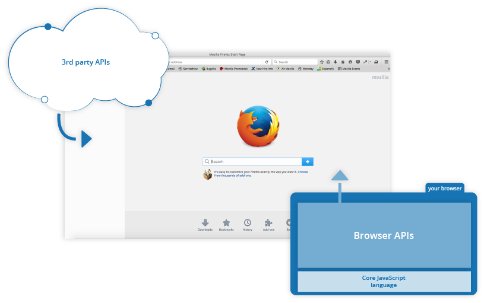

# 시작하기



## Javascript란?

JavaScript(JS)는 가벼운 인터프리터 또는 **JIT컴파일** 언어

 - JIT 컴파일

JIT 컴파일(just-in-time compilation) 또는 동적 번역(dynamic translation)은 프로그램을 실제 실행하는 시점에 기계어로 번역하는 컴파일 기법

전통적인 입장에서 컴퓨터 프로그램을 만드는 방법

1. 인터프리트 방식은 실행 중 프로그래밍 언어를 읽어가면서 해당 기능에 대응하는 기계어 코드를 실행

2. 정적 컴파일은 실행하기 전에 프로그램 코드를 기계어로 번역한다.

JIT 컴파일러는 두 가지의 방식을 혼합한 방식

실행 시점에서 인터프리트 방식으로 기계어 코드를 생성하면서 그 코드를 캐싱하여, 같은 함수가 여러 번 불릴 때 매번 기계어 코드를 생성하는 것을 방지한다.

최근의 자바 가상 머신과 .NET, V8(node.js)에서는 JIT 컴파일을 지원한다. 즉, 자바 컴파일러가 자바 프로그램 코드를 바이트코드로 변환한 다음, 실제 바이트코드를 실행하는 시점에서 자바 가상 머신이 바이트코드를 JIT 컴파일을 통해 기계어로 변환한다.

바이트코드 컴파일러는 소스 코드를 중간언어인 바이트코드로 변환한다. 바이트코드는 기계어는 아니지만 가상 머신에 의해 기계어로 손쉽게 변환할 수 있는 코드이다. JIT 컴파일러는 바이트코드를 읽어 빠른 속도로 기계어를 생성할 수 있다. 이런 기계어 변환은 코드가 실행되기 과정에 실시간으로 일어나며(그래서 Just-In-Time이다), 전체 코드의 필요한 부분만 변환한다. 기계어로 변환된 코드는 캐시에 저장되기 때문에 재사용시 컴파일을 다시 할 필요가 없다.

일반적인 인터프러터 언어(예시: cpython)는 바이트코드나 소스코드를 최적화 과정이 없기 번역하기 때문에 성능이 낮다. 반면 정적으로 컴파일하는 언어(예시: c 언어)는 실행 전에 무조건 컴파일을 해야하기 때문에 다양한 플랫폼에 맞게 컴파일을 하려면 시간이 오래 걸린다. 동적 컴파일 환경은 실행 과정에서 컴파일을 할 수 있기 위해 만들어졌다. JIT는 정적 컴파일러 만큼 빠르면서 인터프러터 언어의 빠른 응답속도를 추구하기 위해 사용한다. 바이트코드 컴파일러가 시간이 많이 소요되는 최적화를 미리 해주기 때문에 바이트코드에서 기계어 번역은 훨씬 빠르게 진행될 수 있다. 또한 바이트코드는 이식성이 뛰어나 가상 머신이 설치되어 있으면 빠르게 실행할 수 있다.

<br><br>

## Javascript 시작하기


### 자바스크립트 파일 불러오기

 - make `main.js` file first

```javascript
const myHeading = document.querySelector('h1');
myHeading.textContent = 'Hello world!';
```

```html
<script src="scripts/main.js"></script>
```

<br><br>

### 주석
```js
// 한 줄 주석

/* 이건 더 긴,
 * 여러 줄 주석입니다.
 */

/* 그러나, /* 중첩된 주석은 쓸 수 없습니다 */ SyntaxError */
```

<br><br>

### 개발자 모드 console
 - 크롬 `F12`

<br><br>

## 스크립트 로딩은 이렇게

작성된 스크립트를 브라우저가 적절한 때에 로딩하는것에 대해 몇가지 이슈가 있습니다. 중요한 것은 모든 HTML 요소는 순서대로 페이지에 로드된다는 것입니다. 만약 당신이 자바스크립트를 이용해 HTML 요소를 조작할 경우(정확하게는 DOM), 자바스크립트 코드가 조작 대상인 HTML 요소보다 먼저 실행된다면 조작할 요소가 존재하지 않는 상태이기 때문에 제대로 동작하지 않을 것입니다.

내부와 외부의 자바스크립트는 HTML Document의 body가 해석되기 전인 head 부분에 로드되고 실행되었습니다. 이는 에러를 일으킬 수 있습니다. 그래서 여기에 사용되는 몇가지 해결방법들이 있습니다.

 - 내부 JS

```js
<body>


...
...
...


<script>
document.addEventListener("DOMContentLoaded", function() {
  ...
});
</script>
</body>
```

이 이벤트리스너는 "DOMContentLoad" 이벤트가 발생되었을 때 function()을 실행한다는 의미입니다.

"DOMContentLoad" 이벤트는 브라우저가 완전히 로드되고 해석될때 발생됩니다. function(){} 내부의 자바스크립트 구문은 이벤트가 발생되기 전까지는 실행되지 않습니다. 따라서 모든 body태그의 요소가 로드된 이후 자바스크립트 코드가 실행되도록 만들어 에러를 피할 수 있습니다.

 - 외부 JS

```js
<script src="script.js" async></script>
```
일반적으로 HTML요소를 로딩하는 중 \<scirpt>태그를 만나면 JavaScript의 내용이 모두 다운될 때까지 HTML로딩은 멈추게 되는데, async요소는 비동기방식으로 \<script>태그에 도달했을 때 브라우저에게 HTML 요소를 멈추지 않고 다운받도록 유지시킵니다.

이 경우 script와 HTML은 모두 동시에 로드되고 작동할 것입니다.

예전 방식은 scirpt 요소를 body태그의 맨 끝에 넣는 방법이었습니다(</body> 바로 위에). 이 방식을 사용해도 body태그가 모두 로드된 이후 scirpt가 실행되게 만들 수 있습니다. 문제는 이 방법과 DOMContentLoaded를 이용한 방법 모두 HTML DOM이 로드되기 전까지 script의 로딩과 파싱이 완전히 차단된다는 것입다. 이는 많은 자바스크립트 코드를 다루는 규모가 큰 사이트의 경우 사이트를 느리게 만드는 중요한 성능 문제를 야기할 수 있습니다. 이것이 async 속성을 사용해야 하는 이유입니다!


async 스크립트는 페이지 렌더링의 중단 없이 스크립트를 다운로드 하고, 또한 스크립트의 다운로드가 끝나자 마자 이를 실행시킵니다. async는 외부 스크립트끼리의 구체적인 실행 순서는 보장하지 않고, 단지 나머지 페이지가 나타나는 동안 스크립트가 비동기방식으로 다운로드 되어 중단되지 않는다는 것만 보장합니다. async는 각각의 스크립트가 독립적으로, 서로에게 의존하지 않는 관계일 때 적절합니다.

```html
<script async src="js/vendor/jquery.js"></script>

<script async src="js/script2.js"></script>

<script async src="js/script3.js"></script>
```
3개의 스크립트를 로딩하지만 이들의 순서는 보장할 수 없습니다.

script3.js에 있는 함수가 jquery.js의 함수를 사용한다면 에러를 발생될 수 있다는 것을 의미합니다.

```html
<script defer src="js/vendor/jquery.js"></script>

<script defer src="js/script2.js"></script>

<script defer src="js/script3.js"></script>
```
Defer는 이와 다르게 순서대로 다운로드 한 후 모든 스크립트와 내용이 다운로드 되었을 때 실행됩니다:

따라서 위의 예제의 경우에는 jquery.js -> script2.js -> script3.js 의 순서가 보장됩니다.