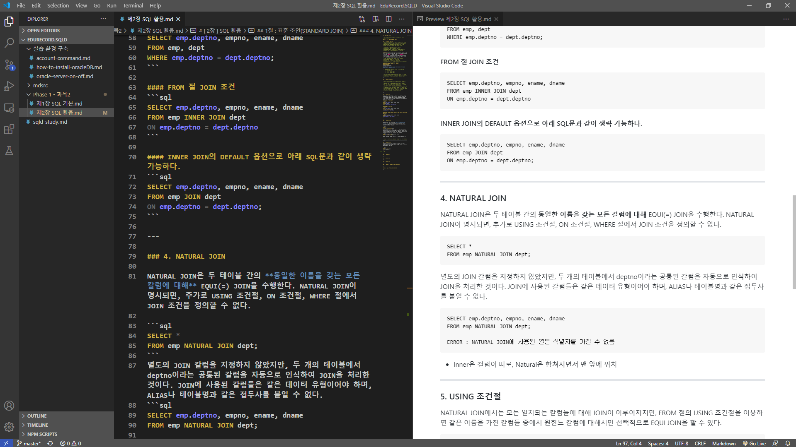
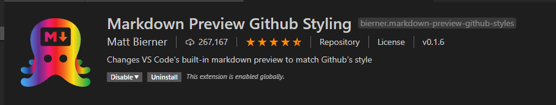
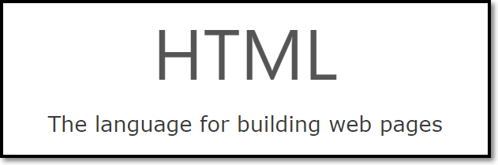

# Github Markdown Guide

## ... 들어가기 전에 ...

필자가 추천하는 Markdown 작성툴은 `Visual Studio Code`이다.



위 화면과 같이 Markdown 작성과 동시에 어떻게 적용되는지 동시에 볼 수 있어 편리하다.

[Visual Studio Code 설치하기](https://code.visualstudio.com/)

일명 `VSCODE`라고 불리는 "Visual Studio Code"를 설치를 다 하였다면 아래와 같은 확장 프로그램을 설치해주면 된다.



이제 마크다운(`.md`) 파일을 만들고  `Ctrl + K`를 누르고 `V`를 누르면 된다.

<br><br><br><br><br><br><br><br><br><br>

---
---
---

## 마크다운 박살내기 시작

### [ 1 ] 계층적 제목 부여

 - #의 갯수 별로 제목 부여가 됩니다.
```md
# 오늘밤 내가 꾸고 싶은 꿈은
## 슬픔 없는 꿈
### 오늘밤 내가 꾸고 싶은 꿈은
#### 기억 못할 꿈
##### 나의 작은 이 가슴이 뛰고 있는 까닭은
###### 아직 나의 작은 별 하나가 잠들지 않아서
```

*------------------------실제화면------------------------*
# 오늘밤 내가 꾸고 싶은 꿈은
## 슬픔 없는 꿈
### 오늘밤 내가 꾸고 싶은 꿈은
#### 기억 못할 꿈
##### 나의 작은 이 가슴이 뛰고 있는 까닭은
###### 아직 나의 작은 별 하나가 잠들지 않아서

*--------------------------------------------------------*

<br><br><br><br><br>

---

### [ 2 ] 목차 순서 부여

 - `-`는 Unordered 목차, `[숫자]`는 Ordered 목차

#### Unordered 예시
```md
  - 언어별 프레임워크와 세부 주요 기술
    - Java
      - Spring
        - WebMVC
        - JSP
        - Security
        - Hibernate/JPA

    - JavaScript
      - Node.js
        - Express
        - Mongoose
```
*------------------------실제화면------------------------*
  - 언어별 프레임워크와 세부 주요 기술
    - Java
      - Spring
        - WebMVC
        - JSP
        - Security
        - Hibernate/JPA

    - JavaScript
      - Node.js
        - Express
        - Mongoose

*--------------------------------------------------------*

#### Ordered 예시
```md
1. 언어별 프레임워크와 세부 주요 기술

   1. Java

      1. Spring

         1. WebMVC

         2. JSP

         3. Security

         4. Hibernate/JPA


   1. JavaScript

      1. Node.js

         1. Express

         1. Mongoose
```

*------------------------실제화면------------------------*

1. 언어별 프레임워크와 세부 주요 기술

   1. Java

      1. Spring

         1. WebMVC

         2. JSP

         3. Security

         4. Hibernate/JPA


   1. JavaScript

      1. Node.js

         1. Express

         1. Mongoose

*--------------------------------------------------------*

 - 위 예시처럼 계층 형태로 순서를 매길 수 있습니다.
 - 연속된 계층 형태라면 `12345`처럼 순서를 매기지 않고 `11111`처럼 순서를 매기더라도 자동으로 연속된 숫자로 만들어줍니다.
<br><br><br><br><br>

---

### [ 3 ] 텍스트 강조

 - 진하게 : \*\*강조할 문자열\*\*

 - 블록 : \`블록처리할 문자열\`

 - 기울이기 : \*기울일 문자열\*

 - 생략표시 : \~\~생략표시할 문자열\~\~

*------------------------실제화면------------------------*

**강조할 문자열**

`블록처리할 문자열`

*기울일 문자열*

~~생략표시할 문자열~~

*--------------------------------------------------------*

<br><br><br><br><br>

---

### [ 4 ] 구간 나누기

 - `<br>` : 개행
 - `<hr>` 혹은 `---` : 선긋기
 - 간략화
```html
<details>
    <summary>간략히 보일 문자열</summary>
    [간략히 보일 문자열]을 클릭할 때 나오는
    [자세하게 보일 문자열]부분
</details>
```

#### EXAMPLE
```md
안녕하세요.<br>코요테입니다.<br>

---
안녕하세요.<br>코요테입니다.<br>저희 음악을 한번 들어보실래요?

<details>
    <summary>코요태 - 실연</summary>

<hr>
&nbsp;&nbsp;&nbsp;&nbsp;나 떠난후 많이 울었어. 혼자가 되어 버렸어<br>
나 다시는 널 볼수 없게 된거니<br>
딴 사람을 만나다 보면 쉽게 널 잊을거라던<br>
내 단순했던 생각이 틀린거야<br>
나만을 사랑한다 했잖아. 너만 바라보게 했잖아<br>
넌 나를 떠나 정말 괜찮은 거니 가끔씩 외로움에 취애서<br>
너를 많이 원망했었어 날 버린 니가 너무너무 미웠어<br>
이대로 날 떠나면 안돼 제발 포기하지 말아줘<br>
널 사랑할 때 가장 행복했었어<br>
Get ready G double Ogoo's on to go Ay Yo Yo 3 4 4<br>
Here we go 잊혀져가 고 고 고 너를 믿었고고 너를<br>
보고만 있을 때면 난 uh! 행복했지만<br>
You're on my mind baby all the time but<br>
I found myself that can't deny Bow I didn't want to<br>
Say good bye bye 너의 모습 멀어져만 가 가.<br>

<hr>
</details>

```

*------------------------실제화면------------------------*

안녕하세요.<br>코요테입니다.<br>저희 음악을 한번 들어보실래요?

<details>
    <summary>코요태 - 실연</summary>

<hr>
&nbsp;&nbsp;&nbsp;&nbsp;나 떠난후 많이 울었어. 혼자가 되어 버렸어<br>
나 다시는 널 볼수 없게 된거니<br>
딴 사람을 만나다 보면 쉽게 널 잊을거라던<br>
내 단순했던 생각이 틀린거야<br>
나만을 사랑한다 했잖아. 너만 바라보게 했잖아<br>
넌 나를 떠나 정말 괜찮은 거니 가끔씩 외로움에 취애서<br>
너를 많이 원망했었어 날 버린 니가 너무너무 미웠어<br>
이대로 날 떠나면 안돼 제발 포기하지 말아줘<br>
널 사랑할 때 가장 행복했었어<br>
Get ready G double Ogoo's on to go Ay Yo Yo 3 4 4<br>
Here we go 잊혀져가 고 고 고 너를 믿었고고 너를<br>
보고만 있을 때면 난 uh! 행복했지만<br>
You're on my mind baby all the time but<br>
I found myself that can't deny Bow I didn't want to<br>
Say good bye bye 너의 모습 멀어져만 가 가.<br>

<hr>
</details>

*--------------------------------------------------------*
 - `&nbsp;`와 같은 HTML에 쓰이는 문자도 먹히지만 모든 HTML 문법이 적용되지는 않으니 직접 Github에 올려 실제로 어떻게 적용되는지 보는게 필요합니다.

<br><br><br><br><br>

---

### [ 5 ] 링크 걸기

 - 다음과 같이 사용하면 됩니다. `[실제로 사용자에게 보이는 문자열](실제 파일 경로 및 네트워크 경로)`

```md
[NAVER로 이동하기](https://www.naver.com/)
```

*------------------------실제화면------------------------*

[NAVER로 이동하기](https://www.naver.com/)

*--------------------------------------------------------*

 - 책갈피 역할을 할 내부 링크는 아래와 같이 하면 된다. 공백은 `-`로 처리하자. `#`의 갯수를 주의하자

```
[맨 위로](#Github-마크다운-익히기)
[이전 목차](#[-4-]-구간-나누기)
```
[맨 위로](#Github-마크다운-익히기)

[이전 목차](#[-4-]-구간-나누기)

<br><br><br><br><br>

---

### [ 6 ] 이미지 올리기

 - 링크 걸기와 똑같이 적용하고 맨 앞에 느낌표(`!`)만 붙여주면 끝
 - ``

```md

```

*------------------------실제화면------------------------*


*--------------------------------------------------------*

<br><br><br><br><br>

---

### [ 7 ] 이미지 + 링크 콤비네이션 기법
 - `[ 5 ] 링크 걸기`와 `[ 6 ] 이미지 올리기`를 합치면 이미지를 클릭할 때 지정된 경로로 이동하게 만드는 것도 가능합니다.

 - 먼저 링크를 걸고`[](https://www.w3schools.com/)`

 - `[]`공간에 이미지 적용 문법을 넣습니다.

#### EXAMPLE
```md
[](https://www.w3schools.com/)
```

*------------------------실제화면------------------------*

[](https://www.w3schools.com/)

*--------------------------------------------------------*
 - 참고로 움직이는 이미지인 `.gif`를 사용하면 더욱더 역동적인 마크다운 파일을 만들 수 있습니다.

<br><br><br><br><br>

---

### [ 8 ] 테이블 만들기

 - 생각보다 자주 쓰는 문법입니다.
```md
|:---|      왼쪽 정렬 (default)
|:---:|     가운데 정렬
|---:|      오른쪽 정렬
```

#### EXAMLE
```md
|Value|Description|
|:---:|:---|
|disc|	Sets the list item marker to a bullet (default)|
|circle|	Sets the list item marker to a circle|
|square|	Sets the list item marker to a square|
|none|	The list items will not be marked|
```

*------------------------실제화면------------------------*

|Value|Description|
|:---:|:---|
|disc|	Sets the list item marker to a bullet (default)|
|circle|	Sets the list item marker to a circle|
|square|	Sets the list item marker to a square|
|none|	The list items will not be marked|

*--------------------------------------------------------*

<br><br><br><br><br>

---

### [ 9 ] 체크리스트 만들기
 - `- [ ]` : 비어있는 체크박스
 - `- [X]` : 체크된 체크박스

#### EXMPALE
```md
### 채크 리스트 만들기
 - [X] 세미나 진행하기
 - [ ] 깃허브 공부하기
 - [ ] 자바스크립트 문서 분석
```

*------------------------실제화면------------------------*

### 채크 리스트 만들기
 - [X] 세미나 진행하기
 - [ ] 깃허브 공부하기
 - [ ] 자바스크립트 문서 분석

*--------------------------------------------------------*

<br><br><br><br><br>

---

### [ 10 ] 제일 중요! 코드 박스 만들기
 - Github에서 Markdown 특히 `Readme.md`는 보통 레파지토리에 대한 설명이나 오픈소스에 대한 사용법을 적습니다.

 - 그러므로 사용자들에게 소스코드를 정갈하게 보이는 것이 중요합니다.

 - 먼저 \`\`\` &nbsp;&nbsp;&nbsp;&nbsp;&nbsp; \`\`\` 블록을 만듭니다.

 - 만일 자바와 관련된 코드라면 \`\`\`java &nbsp;&nbsp;&nbsp;&nbsp;&nbsp; \`\`\` 이렇게 사용하면 자바 코드에 맞게 색깔들이 달라집니다.

#### Example
 - **TIP-1** : 본 예시는 \`\`\` &nbsp;&nbsp;&nbsp;&nbsp;&nbsp; \`\`\`가 아닌 \<pre> ~~~ \</pre>를 사용하였는데<br> \`\`\` &nbsp;&nbsp;&nbsp;&nbsp;&nbsp; \`\`\` 안에 다시 \`\`\` &nbsp;&nbsp;&nbsp;&nbsp;&nbsp; \`\`\`를 적용시키면 보이질 않기 때문이다.

 - **TIP-2** : 가끔 문서를 작성하다가 \<tag>와 같은 글을 쓰고 싶을 것이다. 그러나 Markdown이 태그로 인식하면서 문자열로 보이지 않는 현상이 일어나는데 그 때는 `\<tag>`와 같이 앞에 `\`를 붙여주면 된다. 이 같은 원리로 문법 및 키워드로 인식하는 문자를 보이게 하고 싶을 때는 이스케이프(`\`)문자를 사용하면 된다.

<pre>

**JAVA 언어**

```java
public class MyClass{
    public static void main(String[] args){
        System.out.println("Hello World");
    }
}
```

**PYTHON 언어**

```python
print("Hello World")
```

**RDBMS 쿼리**

```sql
SELECT *
FROM emp
WHERE sal >= 1000
ORDER BY empno
```
</pre>

*------------------------실제화면------------------------*

**JAVA 언어**

```java
public class MyClass{
    public static void main(String[] args){
        System.out.println("Hello World");
    }
}
```

**PYTHON 언어**

```python
print("Hello World")
```

**RDBMS 쿼리**

```sql
SELECT *
FROM emp
WHERE sal >= 1000
ORDER BY empno
```


*--------------------------------------------------------*
 - 위 예시 말고도 많은 언어들을 적용할 수 있다.

 **HTML 언어**

```html
<!DOCTYPE html>
<html lang="en">
<head>
    <meta charset="UTF-8">
    <meta name="viewport" content="width=device-width, initial-scale=1.0">
    <title>Document</title>
</head>
<body>
    <p>Hello World!</p>
</body>
</html>
```
<br><br><br><br><br>

---

### [ 11 ] 이모티콘
  
 - `:robot:`(:robot:)과 같이 `:이모티콘 코드:`로 이모티콘을 넣을 수 있다.

--> [이모티콘 리스트 보기](./Emoji-List.md)

 - 그러나 언제다봐... 

 - 이 사이트를 이용하면 다양한 이모티콘을 넣을 수 있다.
```
https://emojipedia.org/people/
```
--> [이모티콘 사이트로 이동하기](https://emojipedia.org/people/)

 - 마음에 드는 이모티콘을 고르고 걍 복붙하면 된다. 물론 이모티콘 코드도 있다. 다만 같은 이모티콘이라도 각 환경에 따라 다르게 보일 수 있다는 점을 유념하면 된다.

<br><br><br><br><br>

---

### [ 12 ] 각주
```md
주석을 적용할 문장[^1]

[^1]: 주석에 작성할 내용
```

*------------------------실제화면------------------------*

주석을 적용할 문장[^1]

[^1]: 주석에 작성할 내용

*--------------------------------------------------------*

 - VSCODE 미리보기에는 적용안되니 당황하지 마용^^

<br><br><br><br><br>

---

### [ 13 ] 그 밖의 팁

 - 자신의 Github 유저네임과 동일한 Repository를 만들면, 해당 Repository의 `readme.md`가 해당 유저의 Overview 페이지에 바로 보이도록 반영시킬 수 있습니다. 즉, 만일 나의 유저 이름이 CODCODE라면 Repository 이름도 CODCODE로 하면 됩니다.

 - Github 뿐만아니라 자신이 운영하고 있는 다양한 플랫폼에 이동할 수 있도록 `[ 7 ] 이미지 + 링크 콤비네이션 기법`을 활용하여 이쁘게 뱃지링크를 만들 수도 있습니다. 

[](https://www.linkedin.com)
```
[](https://www.linkedin.com) 
```

[](mailto:example@gmail.com) 

```
[](mailto:example@gmail.com) 
```
[](http://github.com/RHIE-coder)
```
[](http://github.com/RHIE-coder)
```

[](https://scholar.google.com) 
```
[](https://scholar.google.com) 

```

[](https://www.youtube.com) 
```
[](https://www.youtube.com) 
```
[](https://www.facebook.com) 
```
[](https://www.facebook.com) 

```

[](https://www.instagram.com) 
```
[](https://www.instagram.com) 
```

[](https://brunch.co.kr) 
```
[](https://brunch.co.kr) 
```

[](https://www.naver.com/)
```
[](https://www.naver.com/)
```

[](http://www.tistory.com/)

```
[](http://www.tistory.com/)
```

# END

